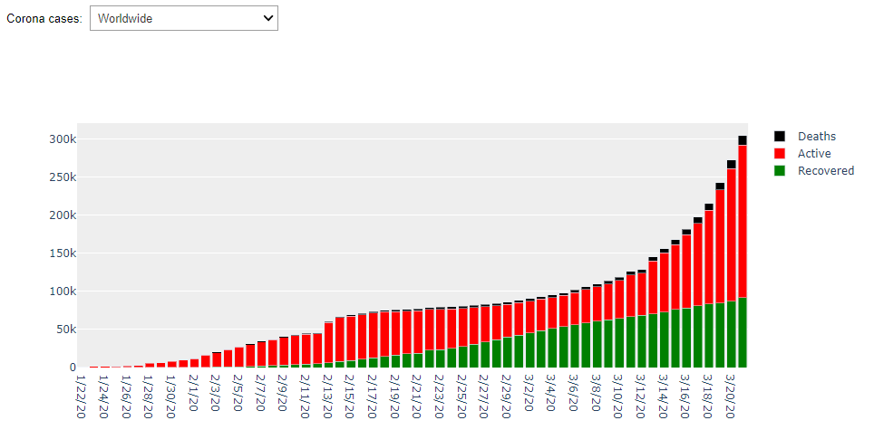
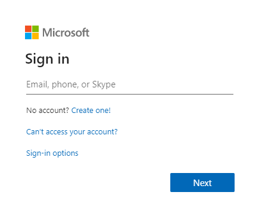
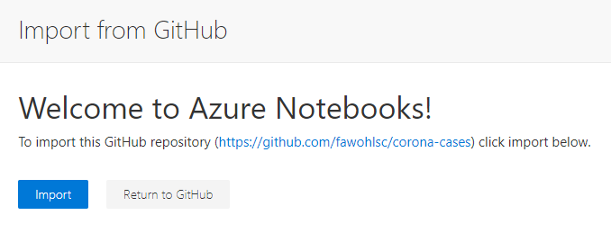
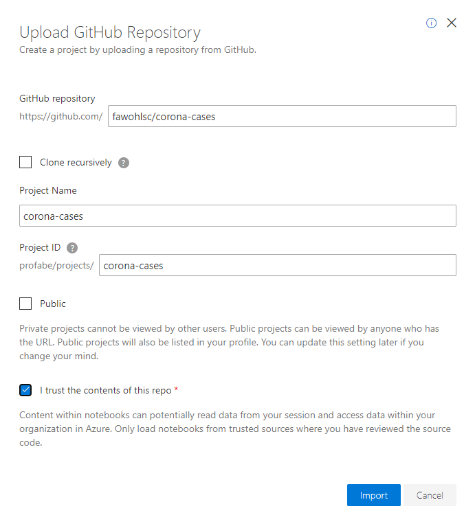
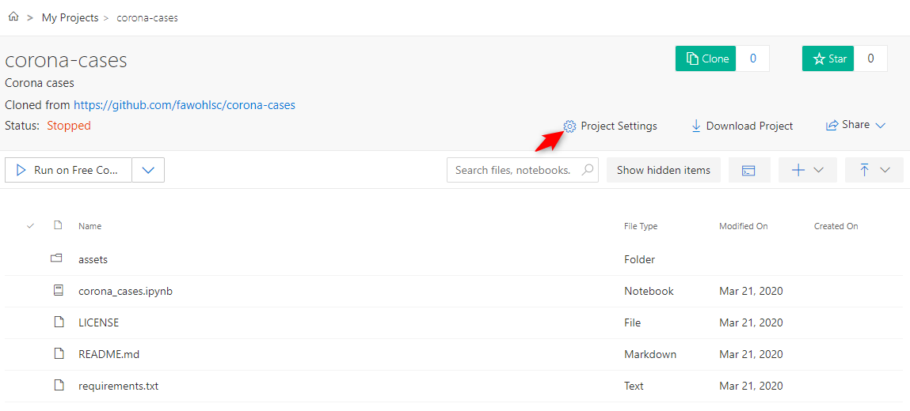
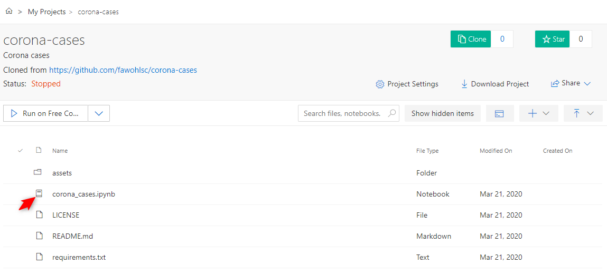
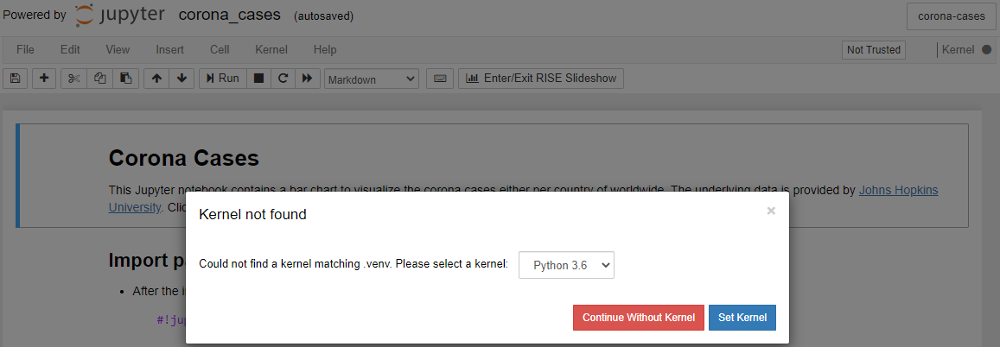
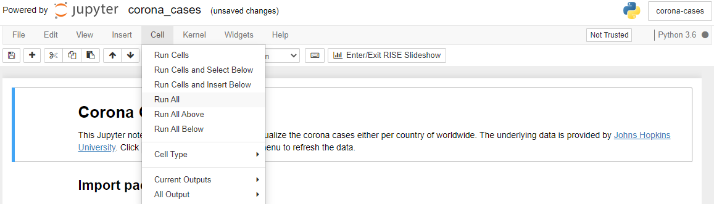
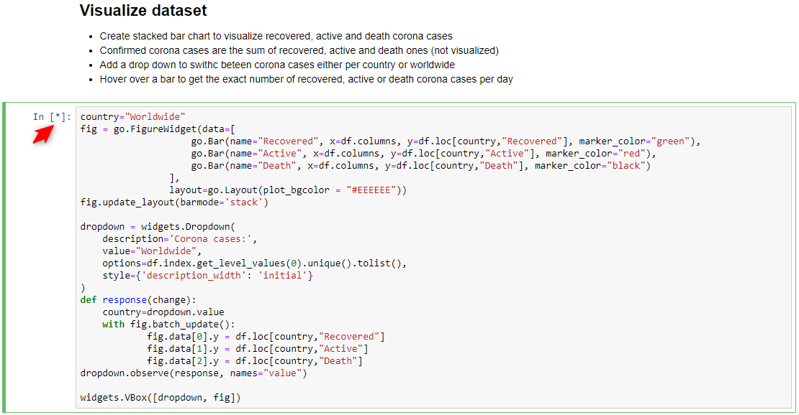

# Corona cases
This repository contains a Jupyter notebook to visualize the corona cases (COVID-19) either per country of worldwide. The underlying dataset is provided by the [Johns Hopkins University](https://github.com/CSSEGISandData/COVID-19/). 



## Launch as Azure Notebook
1. Click this button to launch this Jupyter notebook within an Azure Notebook<br/>
[](https://notebooks.azure.com/import/gh/fawohlsc/corona-cases)

2. Sign in with your Microsoft account, but other accounts like Google work as well<br/>


3. Click ```Import``` to configure the import from the GitHub repository into Azure Notebooks<br/>


4. Select the options according to belows screenshot and start the import by clicking ```Import```<br/>


5. Configure the project setttings to install the required packages into your Jupyter notebook<br/>


6. Configure the environment setup steps (```Requirements.txt```, ```requirements.txt```, ```Python Version 3.6```)<br/>


7. Launch the Jupyter notebook by clicking on ```corona_cases.ipynb``` - it will open in another browser tab<br/>


8. Set the Kernel for the Jupyter notebook to be ```Python 3.6``` or higher - confirm by clicking ```Set Kernel```<br/>


9. Run the Jupyter Notebook by selecting ```Cell -> Run All ```<br/>


10. Wait a few seconds for the run to complete as indicated by the ```[*]``` next to each cell<br/>


11. Scroll down to see the visualization of the Corona cases either per country or worldwide<br/>


12. Repeat step 9 in order to refresh the underlying dataset - the dataset is currently updated once a day by [Johns Hopkins University](https://github.com/CSSEGISandData/COVID-19/)


## Launch on your local computer
1. You need Python 3 to be installed on your system - see [https://www.python.org/](https://www.python.org/)
2. Furthermore you require pip, which is the python package installer - see [https://pypi.org/project/pip/](https://pypi.org/project/pip/)
3. After that, follow these steps to launch this Jupyter notebook on your machine
```bash
# Install Jupyter notebook
pip3 install jupyter

# Install package dependencies
pip3 install -r requirements.txt

# Enable widget extension in Jupyter notebook
jupyter nbextension enable --py widgetsnbextension

# Run Jupyter notebook
jupyter notebook
```
4. If you are running on Windows, replace aboves ```pip3``` commands with just ```pip```
5. Any code editor will do, e.g. [Visual Studio Code](https://code.visualstudio.com/) with the [Python extension](https://code.visualstudio.com/docs/languages/python)

## Launch in a virtual environment
1. You need Python 3 to be installed on your system - see [https://www.python.org/](https://www.python.org/)
2. Furthermore you require pip, which is the python package installer - see [https://pypi.org/project/pip/](https://pypi.org/project/pip/)
3. Follow these steps to launch this Jupyter notebook within a virtual environment

```bash
# Install Jupyter notebook
pip3 install jupyter

# Install virtual environment
pip3 install virtualenv

# Create virtual environment
python3 -m venv .venv

# Activate virtual environment
source .venv/bin/activate

# Install package dependencies
pip install -r requirements.txt

# Install virtual environment as Jupyter notebook kernel
ipython kernel install --user --name=.venv

# Enable widget extension in Jupyter notebook
jupyter nbextension enable --py widgetsnbextension

# Run Jupyter notebook
jupyter notebook
```
4. If you are running on Windows, replace aboves ```pip3``` commands with just ```pip```
5. Any code editor will do, e.g. [Visual Studio Code](https://code.visualstudio.com/) with the [Python extension](https://code.visualstudio.com/docs/languages/python)