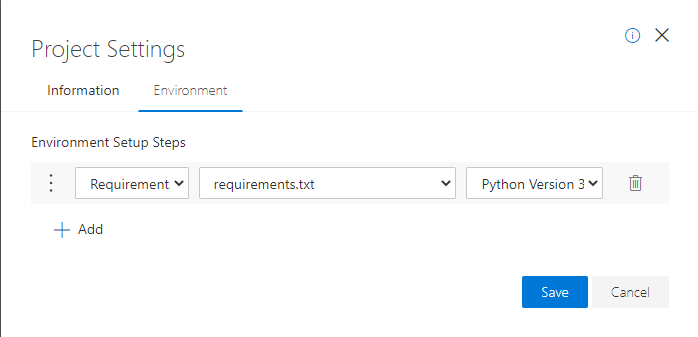

# Corona cases
This repository contains a Jupyter notebook to visualize the corona cases either per country of worldwide. The underlying data is provided by the [Johns Hopkins University](https://github.com/CSSEGISandData/COVID-19/). 

## Launch Azure Notebook
[](https://notebooks.azure.com/import/gh/fawohlsc/corona-cases)

- Don't forget to configure the Environment in the Azure Notebook


## Launch locally
- Follow these steps to launch this Jupyter notebook on your machine
```bash
# Install Jupyter notebook
pip3 install jupyter

# Install package dependencies
pip3 install -r requirements.txt

# Enable widget extension in Jupyter notebook
jupyter nbextension enable --py widgetsnbextension

# Run Jupyter notebook
jupyter notebook
```

## Launch virtual environment
- Follow these steps to launch this Jupyter notebook within a virtual environment

```bash
# Install Jupyter notebook
pip3 install jupyter

# Install virtual environment
pip3 install virtualenv

# Create virtual environment
python3 -m venv .venv

# Activate virtual environment
source .venv/bin/activate

# Install package dependencies
pip install -r requirements.txt

# Install virtual environment as Jupyter notebook kernel
ipython kernel install --user --name=.venv

# Enable widget extension in Jupyter notebook
jupyter nbextension enable --py widgetsnbextension

# Run Jupyter notebook
jupyter notebook
```